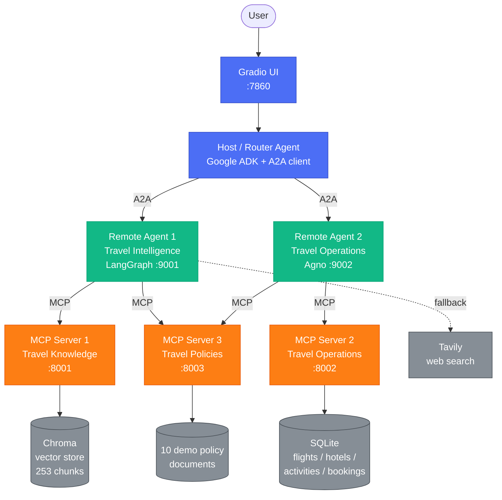
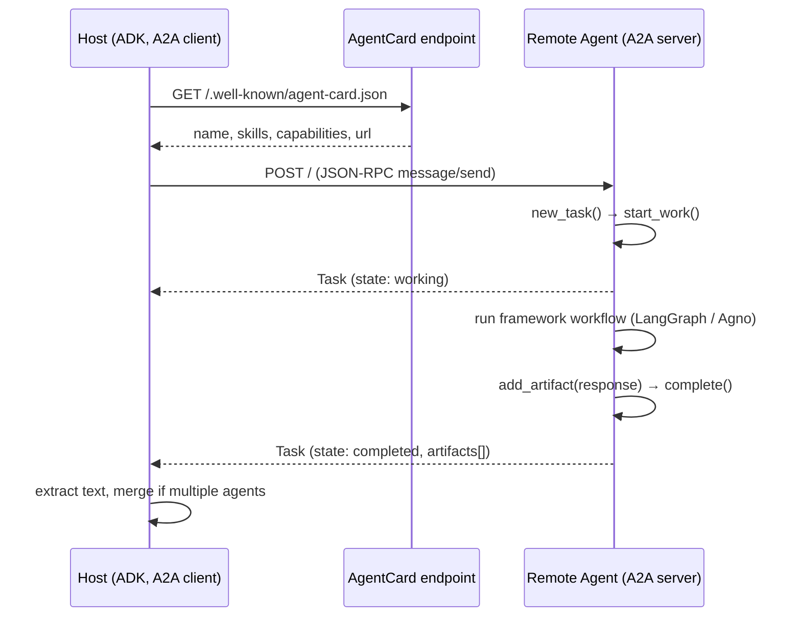
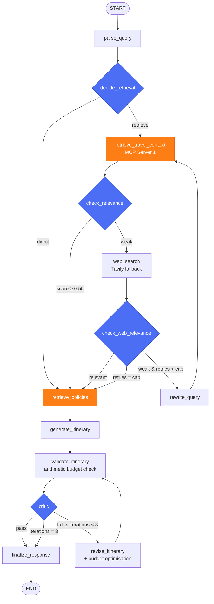
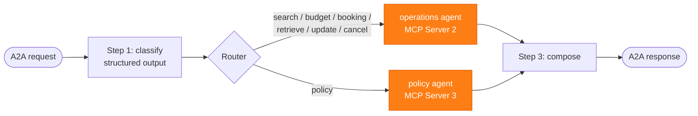
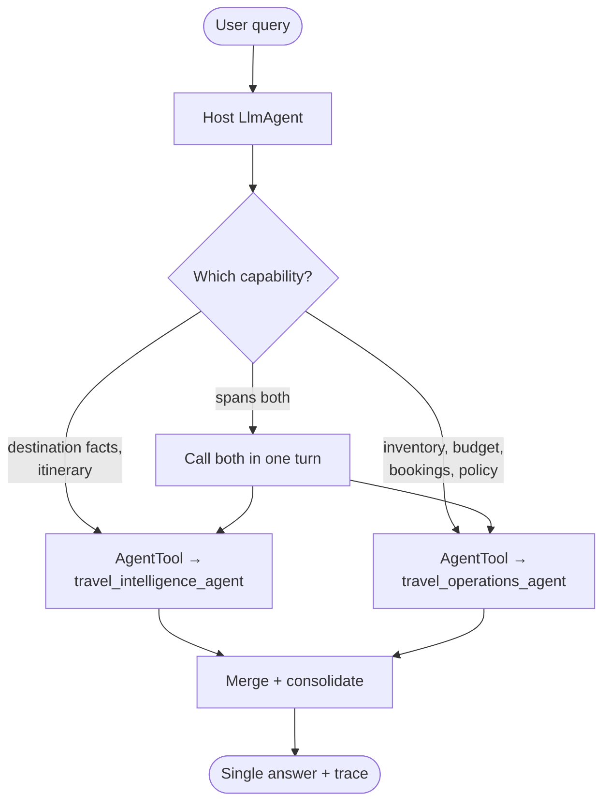

# 🧭 Intelligent Multi-Agent Travel Planning Ecosystem

A production-style prototype of a multi-agent travel assistant built on **Google ADK**,
the **A2A protocol**, **LangGraph**, the **Agno framework**, and **MCP** servers over
streamable HTTP — with retrieval-augmented generation, self-reflective critique,
budget optimisation, and a Gradio UI.

> **This is a demonstration system.** Hotel, activity, and policy data is synthetic.
> **Flights can be live** — with a Duffel test-mode key configured, flight search and
> booking hit the real Duffel API (real airlines and prices), but bookings are sandbox
> orders: no payment is processed and no real seat is held. Without a key, flights fall
> back to synthetic data too. Policy documents are clearly-labelled fictional samples,
> not real airline, hotel, or government policy.

---

## Table of contents

1. [Project overview](#1-project-overview)
2. [Problem statement](#2-problem-statement)
3. [Architecture](#3-architecture)
4. [Agent responsibilities](#4-agent-responsibilities)
5. [MCP server responsibilities](#5-mcp-server-responsibilities)
6. [A2A communication flow](#6-a2a-communication-flow)
7. [LangGraph workflow](#7-langgraph-workflow)
8. [Agno workflow](#8-agno-workflow)
9. [Host routing flow](#9-host-routing-flow)
10. [Data schemas](#10-data-schemas)
11. [Environment setup](#11-environment-setup)
12. [Installation](#12-installation)
13. [Running locally](#13-running-locally)
14. [Running with Docker](#14-running-with-docker)
15. [API endpoints](#15-api-endpoints)
16. [Example queries](#16-example-queries)
17. [Testing](#17-testing)
18. [Troubleshooting](#18-troubleshooting)
19. [Limitations](#19-limitations)
20. [Future improvements](#20-future-improvements)

---

## 1. Project overview

The user talks to a single Gradio chat. Behind it, a **Host Router** built with Google
ADK decides which specialist agent should handle the request and reaches them over the
**A2A protocol**. Each specialist owns its own reasoning framework and its own MCP tool
connections:

| Service | Framework | Port | Responsibility |
| --- | --- | ---: | --- |
| Host / Router | Google ADK + A2A client + Gradio | 7860 | Routes queries, consolidates answers |
| Remote Agent 1 | LangGraph + A2A server + MCP client | 9001 | Destination research, RAG, itinerary planning, self-critique |
| Remote Agent 2 | Agno + A2A server + MCP client | 9002 | Flights, hotels, activities, budget, mock bookings, policies |
| MCP Server 1 | FastMCP (streamable HTTP) | 8001 | Destination knowledge (Chroma vector search) |
| MCP Server 2 | FastMCP (streamable HTTP) | 8002 | Operations database (SQLite): search, budget, bookings |
| MCP Server 3 | FastMCP (streamable HTTP) | 8003 | Travel policy documents as MCP resources |

Every port and URL is configurable through environment variables.

**What makes this genuine multi-agent orchestration rather than several chatbots:**

- The host never touches an MCP tool. It only delegates over A2A.
- The remote agents never talk to each other. They are peers behind the host.
- A single request can fan out to *both* agents in one turn, and the host merges the
  two responses into one answer.
- Every hop is real: real A2A JSON-RPC over HTTP, real MCP sessions over streamable
  HTTP, real vector search, real SQLite transactions.

---

## 2. Problem statement

Planning a trip means juggling questions that live in different systems: *what is worth
seeing*, *what will it cost*, *what is actually bookable*, and *what happens if plans
change*. A single monolithic prompt handles none of these reliably — it hallucinates
prices, invents availability, and silently blows the budget.

This system separates those concerns:

- **Knowledge questions** go to a retrieval-grounded agent that cites what it retrieved
  and falls back to web search when its knowledge base comes up short.
- **Operational questions** go to a database-backed agent that only reports rows that
  actually exist.
- **Arithmetic** is done in Python, not by a language model, so the budget verdict is
  always internally consistent.
- **Quality control** is explicit: a critic reviews every itinerary against the request
  and sends it back for revision when it fails.

---

## 3. Architecture



The enforced call path is:

```
User → Host Agent → A2A → Remote Agent → MCP Server → MCP Tool/Resource
     → Remote Agent → Host Agent → User
```

```
                         USER (chats in the browser)
                                   │
                                   ▼
                        ┌────────────────────┐
                        │   Gradio UI  :7860  │
                        └─────────┬──────────┘
                                  ▼
                     ┌──────────────────────────┐
                     │  HOST / ROUTER  (ADK)     │   decides who should answer
                     │  A2A client               │
                     └───────┬───────────┬──────┘
                     (A2A)   │           │   (A2A)
                             ▼           ▼
         ┌───────────────────────┐   ┌──────────────────────────┐
         │ AGENT 1  :9001         │   │ AGENT 2  :9002            │
         │ Travel Intelligence    │   │ Travel Operations         │
         │ (LangGraph, RAG,       │   │ (Agno workflow)           │
         │  self-critique)        │   │                           │
         └────┬──────────┬───────┘   └──────┬──────────┬────────┘
        (MCP) │          │ (MCP)     (MCP)  │          │ (MCP)
              ▼          ▼                  ▼          ▼
     ┌──────────────┐  ┌───────────────┐  ┌──────────────┐  (policies shared
     │ MCP 1  :8001 │  │ MCP 3  :8003  │  │ MCP 2  :8002 │   by both agents)
     │ Knowledge    │  │ Policies      │  │ Operations   │
     │ (vectors)    │  │ (documents)   │  │ (SQLite +    │
     └──────┬───────┘  └───────────────┘  │  Duffel)     │
            ▼                              └──────┬───────┘
     ChromaDB (253                                ▼
     knowledge chunks)               SQLite (hotels/activities/
            ▲                        bookings)  +  Duffel API (flights)
            │
     Tavily web search (fallback for Agent 1)
```

More diagrams: [docs/architecture.md](docs/architecture.md),
[docs/sequence_diagrams.md](docs/sequence_diagrams.md).

---

## 4. Agent responsibilities

### Host / Router Agent (`host_agent/`)

Google ADK `LlmAgent` whose two tools are `RemoteA2aAgent` wrappers around the remote
agents, each loaded from its published AgentCard.

They are exposed as **`AgentTool`s rather than `sub_agents`** deliberately: sub-agent
transfer hands control to exactly one agent and never comes back, which cannot serve a
request like *"plan a trip, find hotels, estimate the cost, and explain the cancellation
policy."* As tools, the host can call one or both in a single turn and then synthesise
one consolidated answer.

| File | Role |
| --- | --- |
| `router.py` | ADK agent, remote A2A agent definitions, structured route classifier |
| `runner.py` | ADK Runner wrapper; builds the execution trace from run events |
| `a2a_client.py` | Direct A2A client for health checks and diagnostics |
| `gradio_app.py` | UI: chat, structured form, trace panel, service status |

### Remote Agent 1 — Travel Intelligence (`remote_agent_1/`)

LangGraph state machine implementing corrective, self-reflective RAG.
Skills: `destination_research`, `itinerary_planning`, `travel_recommendation`,
`travel_policy_lookup`, `travel_rag`, `self_reflective_planning`.

### Remote Agent 2 — Travel Operations (`remote_agent_2/`)

Agno `Workflow`: classify → route → compose.
Skills: `flight_search`, `hotel_search`, `activity_search`, `budget_estimation`,
`booking_management`, `travel_policy_lookup`.

---

## 5. MCP server responsibilities

### MCP Server 1 — Travel Knowledge (`:8001`)

Semantic search over 253 embedded chunks drawn from 23 destination guides across 11
countries, stored in Chroma with metadata: `destination`, `country`, `category`,
`season`, `source`, `language`, `tags`.

| Tool | Purpose |
| --- | --- |
| `search_travel_knowledge` | Semantic search with metadata filtering |
| `list_destinations` | Which destinations have coverage |
| `list_categories` | Valid category filter values |

**Progressive filter relaxation** — the retriever never returns nothing just because a
filter was phrased differently. It tries, in order: the exact filters → the destination
reinterpreted as a country (the base is indexed by *city*, so "Japan" must fan out to
Tokyo/Kyoto/Osaka) → without the category → unfiltered. The response reports which
`filter_strategy` produced the results.

### MCP Server 2 — Travel Operations (`:8002`)

SQLite database seeded from versioned CSVs, with a file lock guarding concurrent writes.
**Flights go through a swappable provider layer** (`common/providers/`): live Duffel test
mode when `DUFFEL_API_KEY` is set, otherwise the synthetic database. Hotels and activities
are always synthetic. See [Flight provider](#flight-provider-live-vs-synthetic) below.

| Tool | Purpose |
| --- | --- |
| `search_flights` | Live Duffel offers or synthetic rows; filter by origin, destination, dates, price cap |
| `search_hotels` | Filter by destination, price, rating, category; stay totals |
| `search_activities` | Filter by destination, category, price |
| `calculate_trip_budget` | Total components, compare to target, rank savings levers |
| `create_booking` | Create a mock booking |
| `retrieve_booking` | Look up by id or traveller |
| `update_booking` | Modify fields |
| `cancel_booking` | Soft-cancel (status change; records are never deleted) |

### MCP Server 3 — Travel Policies (`:8003`)

Ten demo policy documents exposed as **MCP resources** under `travel://policies/...`,
plus tools (LLM clients discover tools far more reliably than resources).

Resources: `index`, `visa`, `passport`, `insurance`, `baggage`, `hotel-cancellation`,
`flight-cancellation`, `refund`, `transportation`, `safety`, `booking-modification`.
Each carries `policy_name`, `category`, `destination`, `version`, `effective_date`,
`source`.

Tools: `list_policies`, `get_policy`, `find_policy` (keyword matcher that maps a
natural-language question to the right topic).

---

## Flight provider: live vs synthetic

Flights are the one part of the system that can use **real live data**. A provider layer
sits behind the flight tools so nothing else in the system changes:

```
search_flights / create_booking (MCP Server 2)
        │
        ▼
  get_flight_provider()          ← picks based on FLIGHT_PROVIDER + key presence
        │
   ┌────┴─────┐
   ▼          ▼
DemoProvider  DuffelProvider
(SQLite)      (live Duffel API, test mode)
```

- **No key** → synthetic database, exactly as before.
- **`DUFFEL_API_KEY=duffel_test_...`** → live flight search (real airlines, real prices)
  and real **test-mode** bookings that return an airline booking reference. No payment is
  processed and no real seat is held.
- City names are mapped to IATA codes (`common/providers/airports.py`) — e.g. "London" →
  `LHR`, "Tokyo" → `HND` — because Duffel works in airport codes.
- Every live path degrades gracefully: a Duffel outage, an unresolvable route, or an
  expired offer falls back to the synthetic database or a clear message, so flight search
  never hard-fails.
- **Hotels have no free live-booking API** (every real provider requires a commercial
  contract), so hotels and activities stay synthetic.

Duffel bookings are also mirrored into the SQLite `bookings` table, so `retrieve_booking`
and `cancel_booking` work uniformly across live and synthetic bookings.

## 6. A2A communication flow



Both agents are served by the shared scaffolding in `common/a2a_server.py`, which adapts
any `async handler(query) -> str` into an A2A `AgentExecutor` and publishes a compliant
AgentCard.

---

## 7. LangGraph workflow



Design decisions worth calling out:

- **Budget arithmetic runs in Python, not the model.** `validate_itinerary` extracts the
  cost lines with structured output, then sums and compares them in code. The critic is
  told to trust that verdict, so the plan can never claim to be within budget while the
  numbers say otherwise.
- **Every loop is capped.** `retries` bounds query rewrites (`MAX_RETRIEVAL_RETRIES`,
  default 2), `iteration_count` bounds revisions (`MAX_REVISIONS`, default 3), and the
  compiled graph carries `recursion_limit=40`. When a cap is hit the graph finalises with
  the best effort so far and discloses the unresolved findings.
- **Structured outputs are validated.** Every `with_structured_output` call returns
  `None` on failure and each node has an explicit fallback, so a malformed LLM response
  degrades the answer instead of crashing the graph.

---

## 8. Agno workflow



The classifier distinguishes intent that reads similarly but routes differently — asking
*what the cancellation policy says* is `policy` (MCP Server 3), while asking to *cancel a
booking* is `cancel_booking` (MCP Server 2). The compose step stamps each answer with a
source-appropriate footer: demo estimates for searches, mock-record disclaimers for
booking mutations, fictional-policy disclaimers for policy answers.

---

## 9. Host routing flow



Routing targets recognised by the structured classifier (`common/schemas.RoutingDecision`,
used for logging and the UI preview): `travel_research`, `trip_planning`, `booking`,
`budget`, `policy`, `combined_travel_request`.

The **authoritative** routing record is which AgentTools the host actually invoked —
captured from ADK run events in `runner.py` and surfaced in the trace panel.

---

## 10. Data schemas

### Operational database (SQLite, seeded from `data/seed/*.csv`)

| Table | Columns | Rows |
| --- | --- | ---: |
| `flights` | flight_id, airline, origin, destination, departure_date, return_date, price, available_seats, class | 230 |
| `hotels` | hotel_id, hotel_name, destination, rating, price_per_night, available_rooms, category | 184 |
| `activities` | activity_id, destination, activity_name, category, price, duration, rating | 184 |
| `bookings` | booking_id, booking_type, item_id, traveler_name, booking_date, status, total_cost | 60 |

Coverage is guaranteed per destination: every city has at least one well-rated
mid-range room at or below \$150/night, flights from five core origin hubs, and at
least one food, culture, and sightseeing activity.

### Knowledge base (Chroma)

253 chunks from 23 destination guides. Metadata: `destination`, `country`, `category`
(attractions, food, culture, transportation, safety, accommodation, activities, weather,
local_customs, budget, planning), `season`, `source`, `language`, `tags`.

Destinations span Japan, France, United Kingdom, United States, Italy, Spain, Singapore,
Thailand, Australia, UAE, and India.

### Typed models (`common/schemas.py`)

`RoutingDecision`, `TripSpec`, `CritiqueResult`, `OpsClassification`, `BudgetBreakdown`
— all Pydantic, all used as LLM structured-output schemas.

---

## 11. Environment setup

Copy the template and fill in your keys:

```bash
cp .env.example .env
```

| Variable | Required | Notes |
| --- | --- | --- |
| `GOOGLE_API_KEY` | **yes** | Free Gemini key from [aistudio.google.com/apikey](https://aistudio.google.com/apikey) |
| `TAVILY_API_KEY` | no | Free key from [app.tavily.com](https://app.tavily.com); without it the web fallback is skipped and says so |
| `DUFFEL_API_KEY` | no | Free **test-mode** token from [app.duffel.com](https://app.duffel.com) (starts `duffel_test_`). With it, flight search + booking go live against Duffel; without it flights use synthetic data |
| `FLIGHT_PROVIDER` | no | `auto` (Duffel if key present, else demo), or force `demo` / `duffel` |
| `LLM_MODEL` / `LLM_MODEL_PRO` | no | Default `gemini-flash-lite-latest` |
| `EMBED_MODEL` | no | Default `models/gemini-embedding-001` |
| `MCP1_PORT` … `UI_PORT` | no | Defaults 8001–8003, 9001, 9002, 7860 |
| `HOST` | no | `127.0.0.1` locally, `0.0.0.0` in Docker |
| `MCP1_URL` … `WORKFLOW_AGENT_URL` | no | Override to use Docker service names |
| `MAX_RETRIEVAL_RETRIES` / `MAX_REVISIONS` | no | Loop caps (2 / 3) |
| `LOG_LEVEL` | no | Default `INFO` |

---

## 12. Installation

Requires **Python 3.12** and [uv](https://docs.astral.sh/uv/).

```bash
uv sync
```

Then build the demo data (once):

```bash
uv run python -m scripts.generate_data
```

```bash
uv run python -m scripts.generate_policies
```

```bash
uv run python -m ingest.build_vectordb
```

The vector build embeds 253 chunks and is **throttled to respect the Gemini free-tier
limit of 100 embedding requests per minute** — it takes a few minutes, retries on 429,
and resumes where it left off if interrupted.

---

## 13. Running locally

One command starts all five backend services and the UI:

```bash
uv run python run_all.py
```

Then open **http://127.0.0.1:7860**. Missing data or vector store is built automatically
on first run.

Backend only (for tests):

```bash
uv run python run_all.py --backend-only
```

Or run services individually, each in its own terminal:

```bash
uv run python -m mcp_server_1.main
```

```bash
uv run python -m mcp_server_2.main
```

```bash
uv run python -m mcp_server_3.main
```

```bash
uv run python -m remote_agent_1.main
```

```bash
uv run python -m remote_agent_2.main
```

```bash
uv run python -m host_agent.main
```

---

## 14. Running with Docker

One-off data preparation (generates demo data and builds the vector DB into the mounted
`./data` volume):

```bash
docker compose --profile init up data-init
```

Then start the stack:

```bash
docker compose up --build
```

Open **http://localhost:7860**.

Services address each other by **docker service name** (`http://mcp-server-1:8001/mcp`,
`http://remote-agent-1:9001`, …) through the `*_URL` environment variables — no
hard-coded localhost anywhere inside the containers. Agents wait for their MCP servers
via healthchecks before starting.

Stop and clean up:

```bash
docker compose down
```

---

## 15. API endpoints

| Endpoint | Method | Description |
| --- | --- | --- |
| `http://localhost:7860/` | GET | Gradio UI |
| `http://localhost:9001/.well-known/agent-card.json` | GET | Remote Agent 1 AgentCard |
| `http://localhost:9002/.well-known/agent-card.json` | GET | Remote Agent 2 AgentCard |
| `http://localhost:9001/` | POST | A2A JSON-RPC (`message/send`, `tasks/get`) |
| `http://localhost:9002/` | POST | A2A JSON-RPC |
| `http://localhost:8001/mcp` | POST | MCP streamable HTTP — travel knowledge |
| `http://localhost:8002/mcp` | POST | MCP streamable HTTP — travel operations |
| `http://localhost:8003/mcp` | POST | MCP streamable HTTP — travel policies |

Example A2A call:

```bash
curl -s http://localhost:9002/ -H 'Content-Type: application/json' -d '{"jsonrpc":"2.0","id":"1","method":"message/send","params":{"message":{"role":"user","parts":[{"kind":"text","text":"Find a mid-range hotel in Tokyo under $150 per night."}],"messageId":"m1"}}}'
```

Full details: [docs/api.md](docs/api.md).

---

## 16. Example queries

| # | Query | Routes to |
| --- | --- | --- |
| 1 | Plan a 7-day trip to Japan for 2 people with a budget of \$3,000. | Agent 1 |
| 2 | Plan a 5-day trip to Paris. I love museums and food but don't like nightlife. | Agent 1 |
| 3 | Plan a trip to London for \$2,000. If it exceeds my budget, optimize it. | Agent 1 |
| 4 | Find a mid-range hotel in Tokyo under \$150 per night. | Agent 2 |
| 5 | What are the best cultural activities in Kyoto? | Agent 1 |
| 6 | What is the hotel cancellation policy? | Agent 2 → MCP 3 |
| 7 | Book hotel HT0004 for Demo Traveler A at \$890. | Agent 2 (mock) |
| 8 | Show me booking BK-DEMO001. | Agent 2 |
| 9 | Change booking BK-DEMO002 to status confirmed. | Agent 2 |
| 10 | Plan a 7-day trip to Japan, find suitable hotels, estimate the total cost, and explain the relevant cancellation policies. | **Both agents** |

---

## 17. Testing

Automated suite (unit tests always run; integration tests skip themselves when the
relevant service or API key is unavailable):

```bash
uv run pytest -q
```

Unit tests only — no network, no API key, no running services:

```bash
uv run pytest -q -k "not requires"
```

Standalone smoke tests against live services:

```bash
uv run python -m tests.smoke_mcp
```

```bash
uv run python -m tests.smoke_a2a
```

```bash
uv run python -m tests.e2e_smoke --all
```

| File | Covers |
| --- | --- |
| `test_mcp_server_1.py` | Filter composition, progressive relaxation, semantic retrieval, top-k, empty results |
| `test_mcp_server_2.py` | All 8 tools, input validation, booking lifecycle, live MCP transport |
| `test_mcp_server_3.py` | All 10 policy resources, metadata, keyword matching, demo labelling |
| `test_langgraph.py` | Graph structure, every conditional edge, loop caps, budget parsing |
| `test_agno.py` | Workflow structure, classification, tool routing, compose footers |
| `test_a2a.py` | AgentCard contents, live card serving, real A2A round trip |
| `test_host.py` | Host wiring, no direct MCP access, trace extraction, form composition, orchestration |

---

## 18. Troubleshooting

**`429 RESOURCE_EXHAUSTED` from Gemini**
Free-tier quota. Every model is configured to retry with exponential backoff, and the
vector build is throttled, but sustained bursts can still exhaust the daily cap. Wait
and retry, or use a paid key.

**`Collection [travel_knowledge] does not exist`**
The vector DB has not been built:

```bash
uv run python -m ingest.build_vectordb
```

**`Descriptors cannot be created directly` on startup**
A protobuf/opentelemetry version conflict. `pyproject.toml` pins the working
combination — re-sync:

```bash
uv sync
```

**Agent card unreachable / host says it cannot reach the agents**
Backend services are not running. Start them and check the UI's *Service status* panel:

```bash
uv run python run_all.py --backend-only
```

**`UnicodeEncodeError` on Windows**
Handled: `common/logging_utils.enable_utf8_stdout()` reconfigures stdout to UTF-8 and is
called by every service entry point.

**`Cannot find empty port in range: 7860-7860`**
A host UI from an earlier run is still holding the port. `run_all.py` now detects this
and prints your options instead of a traceback: use the UI that is already open, free the
port, or pick another one. To free it on Windows:

```bash
for /f "tokens=5" %a in ('netstat -ano ^| findstr :7860.*LISTENING') do taskkill /F /PID %a
```

Or just run on a different port:

```bash
UI_PORT=7861 uv run python run_all.py
```

**A port is already in use**
Change it in `.env` (`MCP1_PORT`, `RAG_AGENT_PORT`, `UI_PORT`, …) — everything reads
from configuration. `run_all.py` reuses any service that is already listening, so you can
restart one service in its own terminal without stopping the stack.

**Search returns nothing for a destination**
Only the 23 seeded cities have knowledge coverage. Check with the `list_destinations`
tool; the retriever will relax filters and tell you it did so via `filter_strategy`.

---

## 19. Limitations

- **Live data is flights-only.** With a Duffel key, flight search and booking are live
  (test mode); hotels, activities, and availability elsewhere are synthetic. Hotel booking
  has no free API — every real provider requires a commercial contract.
- **No real payments.** Duffel flight bookings are sandbox (test-mode) orders: a real
  airline reference is issued but no money moves and no real seat is held. Hotel/activity
  bookings write rows to SQLite. Selling real, payable travel would require supplier
  agreements and PCI-compliant payment handling, which is deliberately out of scope.
- **Duffel test data is synthetic underneath.** Test mode returns realistic airline
  schedules but the prices are not real fares and the orders cannot be flown.
- **Fictional policies.** The ten policy documents are invented for the demo and labelled
  as such in the text, the metadata, and every agent response.
- **23 destinations.** Anything outside the seeded set falls back to web search or
  general knowledge, and the itinerary says so.
- **Free-tier rate limits** shape the design: throttled embedding, retry/backoff on every
  model call, and `gemini-flash-lite` as the default model.
- **In-memory A2A task store and ADK session service** — conversation state is lost when
  a service restarts.
- **Single-currency estimates.** The UI accepts a currency but cost estimates are
  reasoned in USD.

---

## 20. Future improvements

- Swap the in-memory task/session stores for Redis or Postgres so sessions survive
  restarts.
- Stream partial responses to the UI over A2A's streaming capability (already advertised
  in both AgentCards).
- Add a real supplier integration behind the same MCP tool interface — the sandbox APIs
  offered by aggregators would slot in without changing any agent code.
- Cache embeddings and retrieval results to cut both latency and free-tier consumption.
- Add multi-city routing with real inter-city travel-time constraints.
- Extend the critic with a factuality check that verifies each itinerary claim against a
  specific retrieved chunk.
- Add authentication and per-user booking isolation.

---

## Project structure

```text
travel-planer/
├── README.md                    ├── docker-compose.yml
├── .env.example                 ├── Dockerfile
├── pyproject.toml               └── run_all.py
│
├── common/                      # shared infrastructure
│   ├── config.py                #   env-driven settings + URLs
│   ├── llm.py                   #   Gemini factories (LangChain / Agno / ADK)
│   ├── a2a_server.py            #   reusable A2A scaffolding
│   ├── db.py                    #   SQLite operations database
│   ├── vectordb.py              #   Chroma access + throttled embedding
│   ├── schemas.py               #   typed models / structured outputs
│   └── logging_utils.py         #   structured logging, secret redaction
│
├── host_agent/                  # Google ADK host + Gradio UI
├── remote_agent_1/              # LangGraph travel intelligence
│   ├── graph.py  state.py  mcp_client.py  a2a_server.py  agent_card.json
│   └── nodes/                   #   parse, retrieve, websearch, itinerary, critic
├── remote_agent_2/              # Agno travel operations
├── mcp_server_1/ 2/ 3/          # MCP servers
├── ingest/                      # vector DB builder
├── scripts/                     # data + policy generation, card export
├── tests/                       # pytest suite + smoke tests
├── docs/                        # architecture, sequences, API, deployment
└── data/                        # knowledge, policies, seed CSVs, chroma, sqlite
```

---

## Framework versions

Built and verified against: `google-adk` ≥ 2.5, `a2a-sdk` ≥ 0.3.4 <1.0,
`langgraph` ≥ 1.2.9, `langchain` ≥ 1.3.14, `agno` ≥ 2.8.2, `mcp[cli]` ≥ 1.28.1,
`chromadb` ≥ 1.5.9, `gradio` ≥ 6.20, Python 3.12.

`protobuf` is pinned `>=6.33,<7` with matching OpenTelemetry versions — the resolver
otherwise picks a combination that crashes ChromaDB on import.
