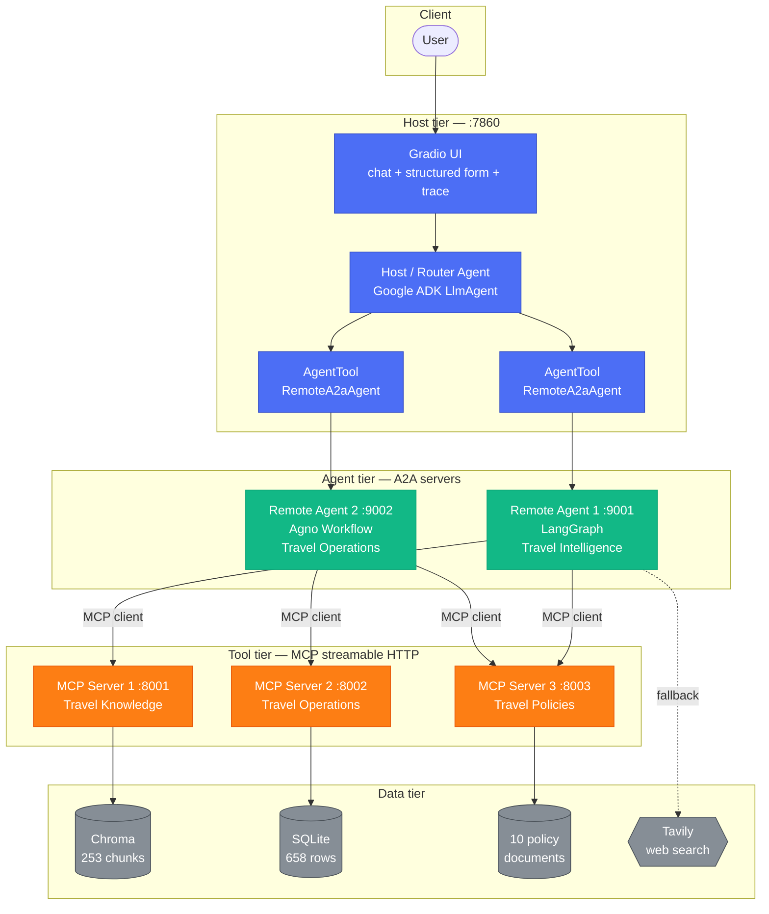
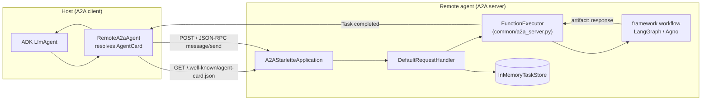
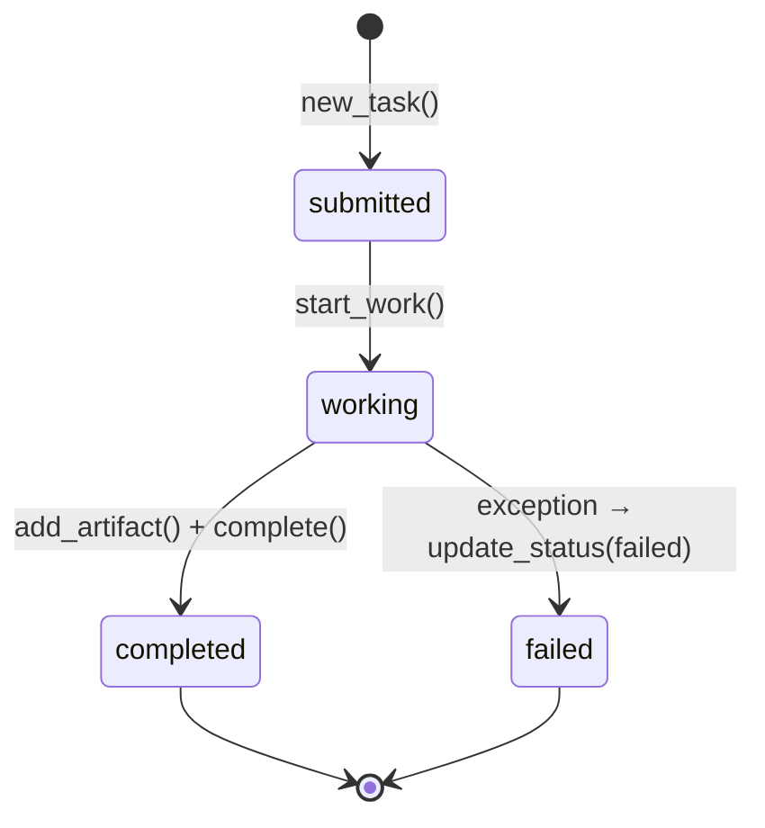
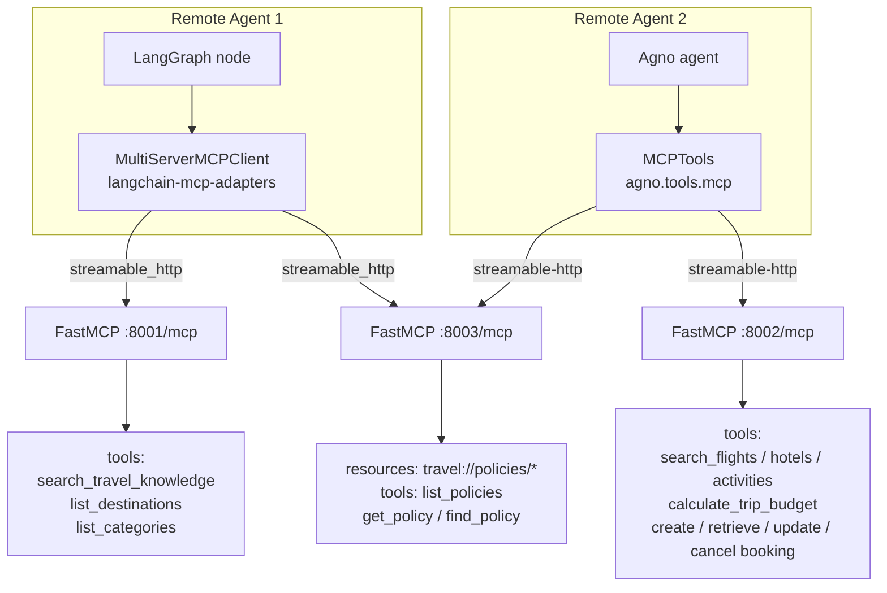
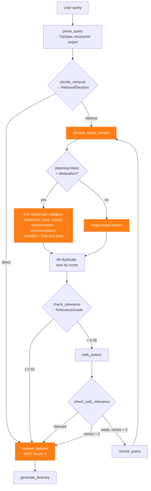
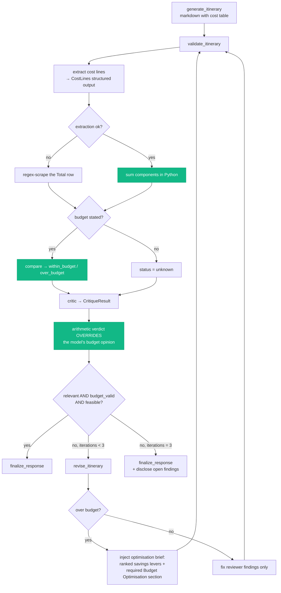

# Architecture

Detailed diagrams and design rationale. See the [README](../README.md) for setup and the
high-level overview.

---

## 1. System architecture



### Tier boundaries (enforced, not just documented)

| Boundary | Rule | Where enforced |
| --- | --- | --- |
| Host → MCP | The host has **no** MCP client and never calls a tool directly | `host_agent/router.py` only holds two `AgentTool`s; asserted by `test_host_has_no_direct_mcp_access` |
| Agent → Agent | Remote agents never call each other; they are peers behind the host | Neither agent imports the other, nor holds the other's URL |
| Agent → MCP | Each agent connects only to the servers it owns | Agent 1 → MCP 1 + 3; Agent 2 → MCP 2 + 3 |

Agent 1 and Agent 2 both reach MCP Server 3, deliberately: Agent 1 needs cancellation
terms to attach to an itinerary, while Agent 2 answers direct policy questions. MCP
Server 3 is read-only, so shared access carries no consistency risk.

---

## 2. A2A communication



`common/a2a_server.py` is framework-agnostic: it adapts any
`async handler(query: str) -> str` into an A2A `AgentExecutor`. That is why the LangGraph
agent and the Agno agent are served by identical scaffolding despite having nothing else
in common — and why adding a third agent would take only a new handler plus an AgentCard.

### Task lifecycle



Handler exceptions become a `failed` task carrying a readable message — never a stack
trace leaking to the user.

---

## 3. MCP communication



Two different MCP client libraries are in play because each framework brings its own —
`langchain-mcp-adapters` exposes MCP tools as LangChain tools, while Agno's `MCPTools` is
an async context manager that binds tools to an agent for the duration of a call. Both
speak the same streamable-HTTP protocol to the same servers.

Agent 1 caches its tool handles after first load (`remote_agent_1/mcp_client.py`); Agent 2
opens a session per request, which is why its MCP branches are wrapped in `async with`.

---

## 4. Corrective RAG in detail



**Why one search per category for itineraries:** a single semantic search over a
7-day-trip query returns whichever chunks are closest overall — often five variations of
"attractions" and nothing about transport. Fanning out per category guarantees the
generator sees the full spread it needs, and de-duplication keeps the context tight.

---

## 5. Self-reflection and budget optimisation



The green steps are plain Python. That matters: a language model asked to check its own
arithmetic will often declare a \$3,450 plan "within a \$3,000 budget". By computing the
sum in code and instructing the critic to trust that verdict, the budget claim in the
final answer is always consistent with the numbers in the table.

**Observed behaviour** (real run, Rome, \$1,500 budget):

```text
Generated itinerary (4221 chars)
Budget validation: total $1,552 vs budget $1,500 → over budget
Critic: FAIL (preference match 100%, 2 issues)
Revised itinerary (attempt 1 of 3)
Budget validation: total $1,500 vs budget $1,500 → within budget
Critic: PASS (0 issues)
Finalised response
```

---

## 6. Loop termination guarantees

Three independent mechanisms, because an agent that cannot stop is worse than one that
gives an imperfect answer:

| Loop | Guard | Default | Behaviour at the cap |
| --- | --- | ---: | --- |
| retrieve → grade → web → rewrite → retrieve | `state["retries"]` vs `MAX_RETRIEVAL_RETRIES` | 2 | Proceed to generation with the best context found |
| validate → critic → revise → validate | `state["iteration_count"]` vs `MAX_REVISIONS` | 3 | Finalise and disclose unresolved findings |
| any unexpected cycle | LangGraph `recursion_limit` | 40 | Graph raises; `answer()` catches and returns a graceful message |

---

## 7. Error handling strategy

| Failure | Handling |
| --- | --- |
| MCP server down | `mcp_client.call_tool` returns `{"error": ...}`; retrieval yields no docs → web fallback engages |
| Vector DB missing | Retriever returns an actionable error naming the build command |
| Embedding 429 | Throttled batching + exponential backoff; ingest resumes from what is already stored |
| LLM 429 / 5xx | `HttpRetryOptions(attempts=6)` on ADK and Agno models; `max_retries=6` on LangChain |
| Structured output invalid | Every call returns `None` on failure; each node has an explicit fallback path |
| Remote agent down | Host catches, returns a graceful message, logs the cause; UI *Service status* panel shows which agent is offline |
| Booking on unknown id | Tool returns a validation error, never a partial write |
| Bad tool input | Validated and rejected with a message naming the offending field |
| Any handler exception | Becomes an A2A `failed` task with a readable message; stack traces stay in the server log |

---

## 8. Observability

`common/logging_utils.py` emits greppable `key=value` lines and redacts anything that
looks like a credential.

```text
event=host_request request_id=e35f48fb query="Find a mid-range hotel in Tokyo…"
event=a2a_delegation request_id=e35f48fb agent=travel_operations_agent
event=request_classified category=search
event=tool_call tool=search_hotels destination=Tokyo count=4 nights=-
event=host_request_complete request_id=e35f48fb agents=['travel_operations_agent'] chars=898
```

Logged: request id, user query, routing decision, agent selected, MCP server and tool
called, retrieval count, relevance result, budget status, critic verdict, revision count,
final status. Never logged: API keys, tokens, authorization headers.
