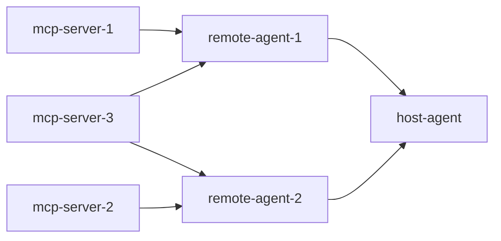

# Deployment

Local development, Docker Compose, and what to change before this could face real users.

---

## 1. Prerequisites

| Requirement | Version | Notes |
| --- | --- | --- |
| Python | 3.12 | Pinned in `.python-version` |
| uv | latest | [docs.astral.sh/uv](https://docs.astral.sh/uv/) |
| Docker + Compose | v2 | Only for the containerised path |
| Gemini API key | free tier works | [aistudio.google.com/apikey](https://aistudio.google.com/apikey) |
| Tavily API key | optional | Web fallback; skipped with a warning if absent |

Free-tier Gemini quotas that shape this deployment:

- **100 embedding requests/minute** → the vector build is throttled and resumable.
- **Per-minute generation limits** → every model is configured with 6 retries and
  exponential backoff.

---

## 2. Local deployment

```bash
cp .env.example .env
```

Add your `GOOGLE_API_KEY` to `.env`, then:

```bash
uv sync
```

```bash
uv run python run_all.py
```

`run_all.py` generates demo data and builds the vector store if either is missing, starts
the five backend services, waits for every port, and then launches the UI on
**http://127.0.0.1:7860**. `Ctrl-C` stops everything.

Backend only, for running tests against live services:

```bash
uv run python run_all.py --backend-only
```

### Startup order

MCP servers must be listening before the agents connect, and both agents must be serving
their AgentCards before the host can resolve them. `run_all.py` enforces this by polling
each port before starting the next tier. It also reuses anything already running, so you
can restart a single service in its own terminal without killing the stack.

---

## 3. Docker deployment

### First run

```bash
docker compose --profile init up data-init
```

This one-off container generates the demo data and builds the Chroma store into the
mounted `./data` volume. It needs `GOOGLE_API_KEY` and takes a few minutes because
embedding is throttled.

### Start the stack

```bash
docker compose up --build
```

```bash
open http://localhost:7860
```

### Service topology

| Compose service | Container | Internal address | Published |
| --- | --- | --- | --- |
| `mcp-server-1` | travel-mcp-1 | `http://mcp-server-1:8001/mcp` | 8001 |
| `mcp-server-2` | travel-mcp-2 | `http://mcp-server-2:8002/mcp` | 8002 |
| `mcp-server-3` | travel-mcp-3 | `http://mcp-server-3:8003/mcp` | 8003 |
| `remote-agent-1` | travel-agent-1 | `http://remote-agent-1:9001` | 9001 |
| `remote-agent-2` | travel-agent-2 | `http://remote-agent-2:9002` | 9002 |
| `host-agent` | travel-host | `http://host-agent:7860` | 7860 |

All six run the same image with a different `command`. Peers are addressed by **service
name** through `MCP1_URL`, `MCP2_URL`, `MCP3_URL`, `RAG_AGENT_URL`, and
`WORKFLOW_AGENT_URL` — there is no hard-coded localhost inside any container.

`HOST=0.0.0.0` makes each service bind all interfaces. Note that outbound URLs must not
use `0.0.0.0`; `common/config.Settings._client_host` handles that distinction, but in
Docker the explicit `*_URL` variables take precedence anyway.

### Dependency ordering



MCP servers expose a TCP healthcheck; agents expose an HTTP healthcheck against their
AgentCard path. Compose `depends_on: condition: service_healthy` means the host only
starts once both agents can actually answer.

### Useful commands

```bash
docker compose logs -f remote-agent-1
```

```bash
docker compose restart mcp-server-2
```

```bash
docker compose ps
```

```bash
docker compose down
```

Rebuild after dependency changes:

```bash
docker compose build --no-cache
```

---

## 4. Configuration reference

| Variable | Default | Purpose |
| --- | --- | --- |
| `GOOGLE_API_KEY` | – | **Required.** Gemini key |
| `GOOGLE_GENAI_USE_VERTEXAI` | `FALSE` | AI Studio vs Vertex |
| `TAVILY_API_KEY` | – | Web-search fallback |
| `LLM_MODEL` | `gemini-flash-lite-latest` | Main model |
| `LLM_MODEL_PRO` | `gemini-flash-lite-latest` | "Pro" slot for heavier steps |
| `EMBED_MODEL` | `models/gemini-embedding-001` | Embeddings |
| `HOST` | `127.0.0.1` | Bind address (`0.0.0.0` in Docker) |
| `MCP1_PORT` / `MCP2_PORT` / `MCP3_PORT` | 8001 / 8002 / 8003 | MCP ports |
| `RAG_AGENT_PORT` / `WORKFLOW_AGENT_PORT` | 9001 / 9002 | Agent ports |
| `UI_PORT` | 7860 | Gradio |
| `MCP1_URL` … `WORKFLOW_AGENT_URL` | derived | Explicit peer URLs (Docker) |
| `MAX_RETRIEVAL_RETRIES` | 2 | Query-rewrite cap |
| `MAX_REVISIONS` | 3 | Itinerary revision cap |
| `LOG_LEVEL` | `INFO` | Logging verbosity |

Ports accept inline comments in `.env` (`MCP1_PORT=8001   # retriever`) — the parser
strips them.

---

## 5. Data management

| Path | Contents | Regenerate with |
| --- | --- | --- |
| `data/knowledge/*.md` | 23 destination guides | `python -m scripts.generate_data` |
| `data/policies/*.md` | 10 demo policies | `python -m scripts.generate_policies` |
| `data/seed/*.csv` | Flights, hotels, activities, bookings | `python -m scripts.generate_data` |
| `data/chroma/` | Vector store (253 chunks) | `python -m ingest.build_vectordb` |
| `data/travel.db` | SQLite operations DB | Auto-seeded from CSV on first start |

Data generation is deterministic (fixed seed), so regenerating produces identical demo
data. The vector build is idempotent and resumable — rerunning it after an interruption
only embeds what is missing.

To reset the operational database completely:

```bash
uv run python -c "from common.db import init_db; print(init_db(force_reseed=True))"
```

`data/chroma/` and `data/travel.db` are gitignored; the CSV seeds and markdown documents
are committed so a clone reproduces the same demo.

---

## 6. Verification checklist

After any deployment:

```bash
uv run python -m tests.smoke_mcp
```

```bash
uv run python -m tests.smoke_a2a
```

```bash
uv run pytest -q
```

```bash
uv run python -m tests.e2e_smoke --all
```

Manual checks:

- [ ] `http://localhost:7860` loads and the *Service status* panel shows both agents online
- [ ] `curl http://localhost:9001/.well-known/agent-card.json` returns 6 skills
- [ ] `curl http://localhost:9002/.well-known/agent-card.json` returns 6 skills
- [ ] A hotel search returns rows with `HT…` ids
- [ ] A trip plan produces a day-by-day itinerary with a budget table
- [ ] A combined request shows **both** agents in the trace panel

---

## 7. Before this could face real users

This is a demonstration system. Production would need at minimum:

**State and scale**
- Replace `InMemoryTaskStore` and `InMemorySessionService` with Redis or Postgres, or
  every restart drops in-flight tasks and conversation history.
- Move SQLite to a real database; the file lock protecting writes does not scale past a
  single host.
- Run more than one replica per agent behind a load balancer, with sticky sessions or
  externalised state.

**Security**
- The A2A endpoints and MCP servers are currently unauthenticated and assume a trusted
  network. Add authentication and authorisation on both, and never publish MCP ports.
- Terminate TLS in front of every service.
- Add per-user isolation on bookings — today any caller can retrieve any booking id.
- Add rate limiting to protect both the services and the model quota.

**Correctness and cost**
- Replace synthetic inventory with a real supplier integration behind the same MCP tool
  interface. Real booking additionally requires supplier agreements and PCI-compliant
  payment handling — deliberately out of scope here.
- Cache embeddings and retrieval results.
- Move from free-tier to provisioned model capacity.

**Operations**
- Ship structured logs to a real aggregator and add distributed tracing across the A2A
  and MCP hops (the `request_id` already threads through).
- Add alerting on agent health, MCP availability, and model error rates.
- Version the policy documents and knowledge base with a review process; nothing should
  reach users as authoritative policy without a human owner.
