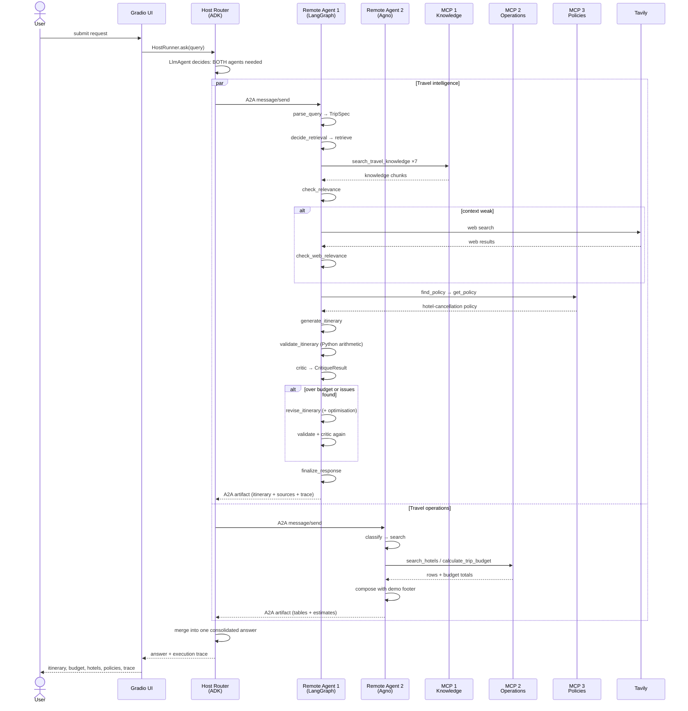
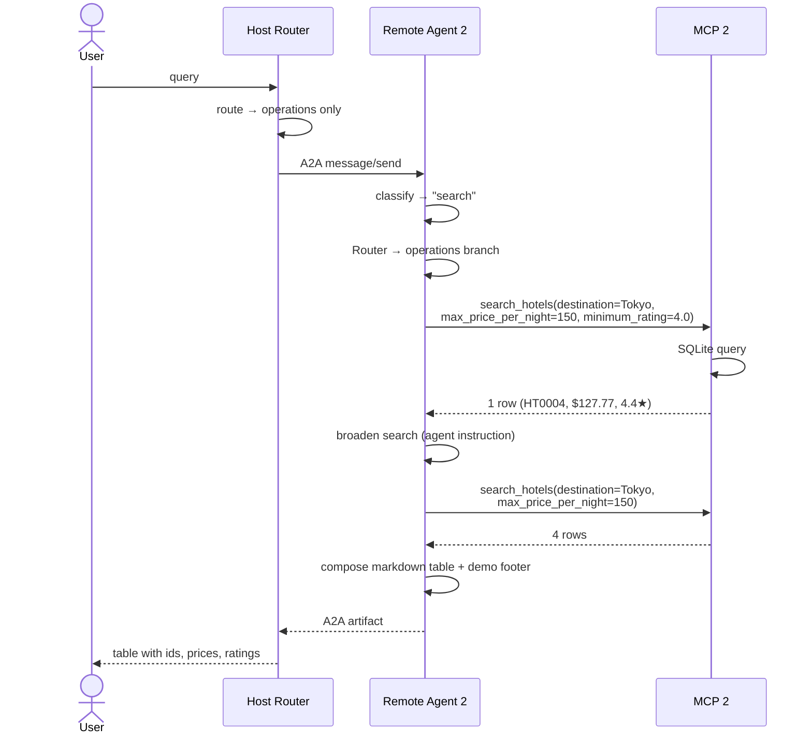
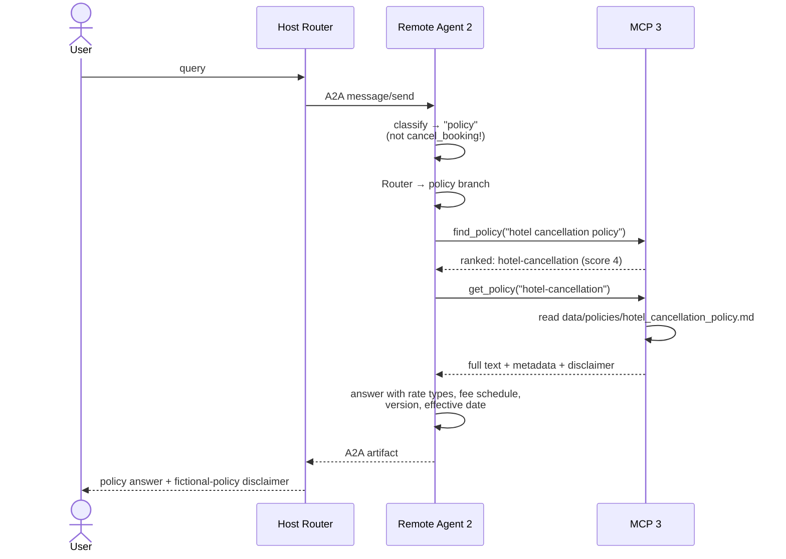
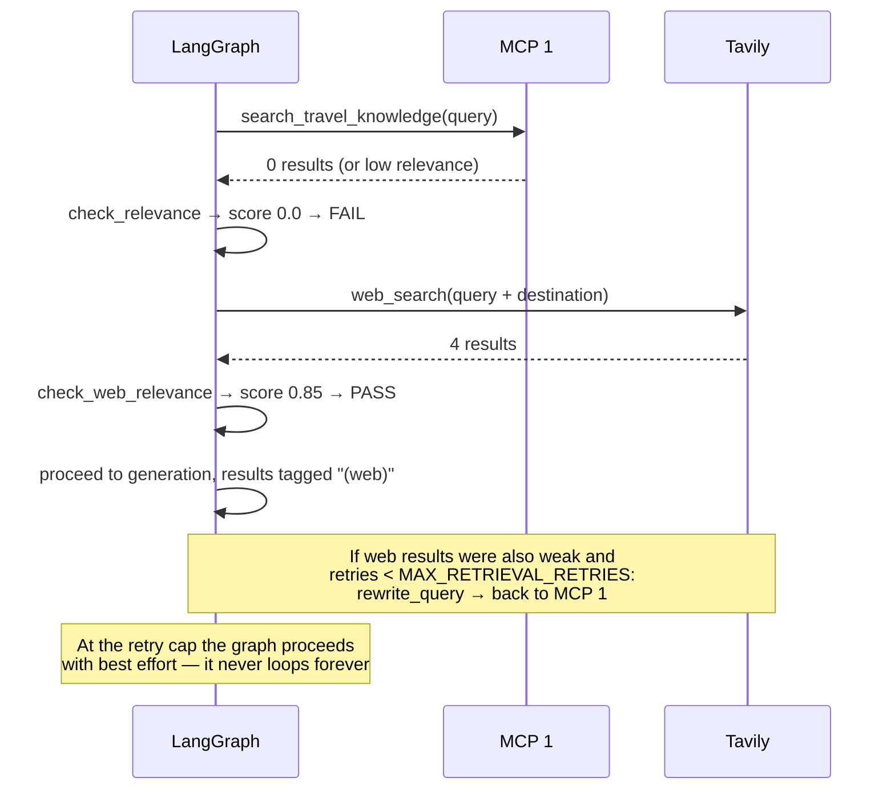
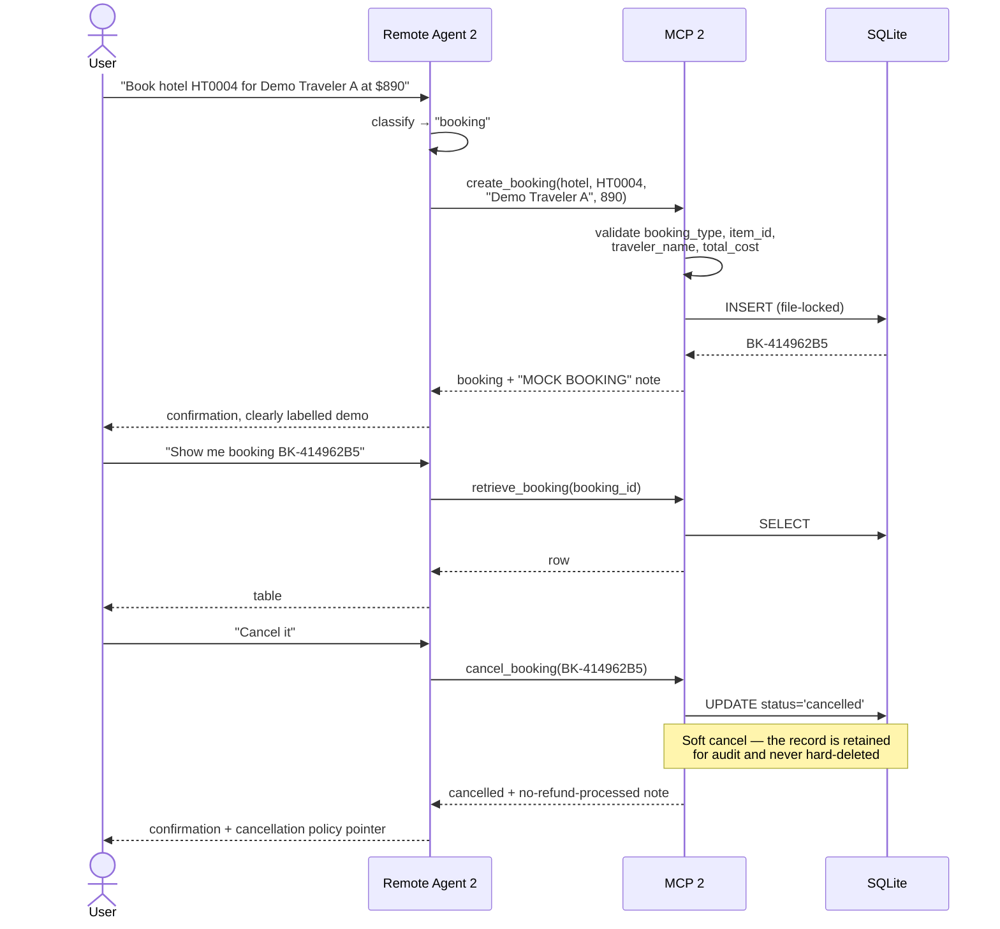
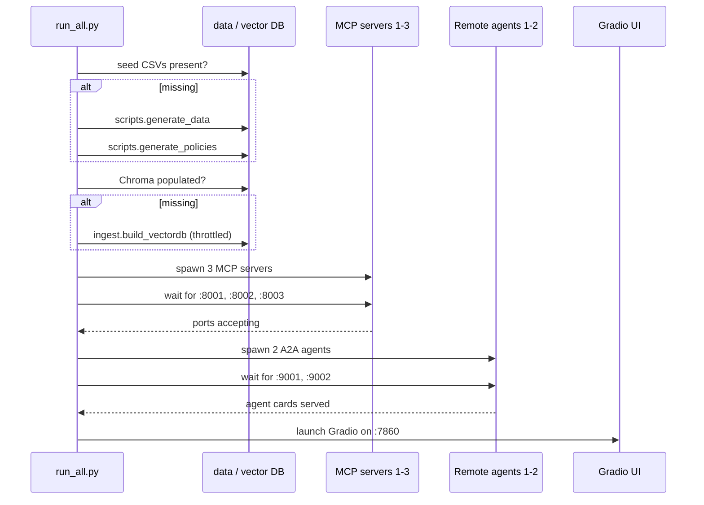

# Sequence diagrams

End-to-end traces for the main request shapes. Every arrow is a real network call.

---

## 1. Full end-to-end: combined multi-agent request

The hardest path — a request that needs both specialists (spec scenario 10).

> *"Plan a 7-day trip to Japan, find suitable hotels, estimate the total cost, and
> explain the relevant cancellation policies."*



**Real observed trace:**

```text
Gradio UI received the request
Host Router (Google ADK) analysing the request
A2A call → Remote Agent 1 — Travel Intelligence (LangGraph)
A2A call → Remote Agent 2 — Travel Operations (Agno)
Response received from Remote Agent 1
    ↳ Parsed request → destination=Japan, 7 days, 1 traveller(s)
    ↳ Retrieval decision: retrieve knowledge (intent=planning)
    ↳ MCP Server 1 → retrieved 8 knowledge chunk(s)
    ↳ Relevance check: PASS (score=1.00)
    ↳ MCP Server 3 → fetched 1 policy document(s): hotel-cancellation
    ↳ Generated itinerary (7087 chars)
    ↳ Budget validation: total $3,150 (no budget given)
    ↳ Critic: PASS (preference match 100%, 0 issue(s))
    ↳ Finalised response
Response received from Remote Agent 2 — Travel Operations (Agno)
Host Router consolidated the final response
```

---

## 2. Single-agent: operational request

> *"Find a mid-range hotel in Tokyo under \$150 per night."*



Note the agent's own retry-with-relaxed-filters behaviour — instructed in
`remote_agent_2/agents.py`, so a strict filter returning one row still yields a useful
answer, and the agent says it broadened the search.

---

## 3. Single-agent: policy question

> *"What is the hotel cancellation policy?"*



The classifier distinguishing *asking about* cancellation from *performing* a
cancellation is the key routing subtlety — the same word routes to two different MCP
servers.

---

## 4. Corrective retrieval: web fallback with query rewrite

Triggered when the internal knowledge base cannot answer.



Web-derived facts are labelled `(web)` in the itinerary and listed separately under
**Sources**, so the user can always tell retrieved knowledge from web content.

---

## 5. Booking lifecycle (all mock)



---

## 6. Startup and dependency order



Under Docker the same ordering is expressed with compose healthchecks: agents wait for
their MCP servers, and the host waits for both agents' AgentCard endpoints to answer.
